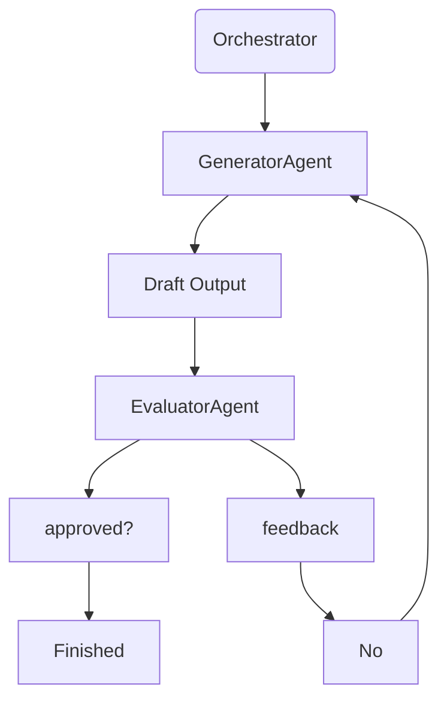

## A basic multi-agent orchestrator
### This python app uses local LLM calls using LM Studio and Gemma-4-e2b or a model of your choice and runs 2 agents: generator_agent, evaluator_agent  

### Flow Diagram




### Example Evaluation
```
{
  "approved": false,
  "scores": {
    "accuracy": 7,
    "clarity": 6,
    "completeness": 5
  },
  "feedback": [
    "Add limitations section",
    "Explain vector search",
    "Reduce jargon"
  ]
}
```

### Example deployment configurations:  

| Agent	| Endpoint	| Model|
|-------|-----------|------|
|Generator  |http://localhost:1234/v1	|Qwen3-32B|  
|Evaluator	|http://localhost:1235/v1	|Qwen3-8B|  
|Generator	|http://localhost:1234/v1	|DeepSeek-R1|  
|Evaluator	|http://localhost:1235/v1	|Gemma 3 12B|  
|Generator	|http://localhost:1234/v1	|Llama 3.3 70B|  
|Evaluator	|http://localhost:1235/v1	|Llama 3.1 8B|  

Our project uses one url, one port, and 2 models.

### Project Structure:  
```
agent_eval/
│
├── app.py
├── llm_client.py
├── generator_agent.py
├── evaluator_agent.py
└── orchestrator.py
```
 
### To run project, download repo, run LM Studio, load models, enter model identifier name into code variables *LLM_URL, GENERATOR_MODEL, EVALUATOR_MODEL* and run these commands:    
```#!/bin/bash
uv venv agent_eval
source agent_eval/bin/activate
uv pip install requests
python app.py

```

